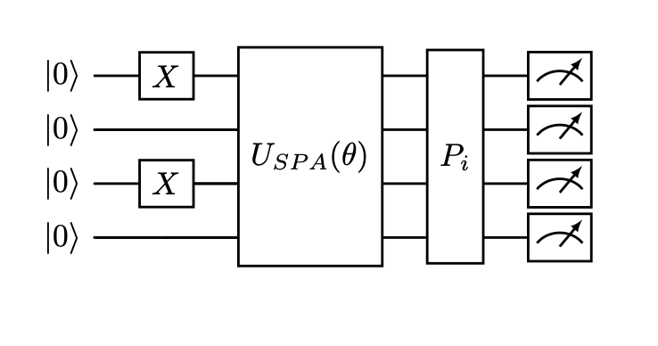

Notice: This file has been modified for the AIM-QC code base. Original: https://github.com/SRI-International/QC-App-Oriented-Benchmarks/blob/master/vqe/README.md

This folder contains a method for application-oriented benchmarking by the QED-C [[2,3]](#references) to benchmark the symmetry-preserving ansatz (SPA) of the Anderson impurity model (AIM). The QED-C benchmarking suite was designed to evaluate quantum computing hardware's performance at executing quantum applications, using high-level metrics such as fidelity, circuit depth, creation time, and execution time. The original benchmarking suite can be found at https://github.com/SRI-International/QC-App-Oriented-Benchmarks. A copy of the license for this suite is included in this folder. Files that have been modified have a notice at the top.

## Benchmarking
The variational quantum eigensolver (VQE) [[4]](#references) algorithm is benchmarked in method 1 by evaluating `max_circuits` different parameters for individual circuits from the VQE algorithm and in method 2 by evaluating all circuits for a single choice of parameters in VQE. These two methods are further explained in the [Circuit Methods](#circuit-methods) section. Each circuit is repeated a number of times denoted by `num_shots`. We then run the algorithm circuit for even numbers of qubits between `min_qubits` and `max_qubits`, inclusive. The test returns the averages of the circuit creation times, average execution times, fidelities, and circuit depths. For this algorithm's fidelity calculation, we compare against the results returned from classical simulation using our [noise-normalized fidelity calculation](../_doc/POLARIZATION_FIDELITY.md), with an additional rescaling.

As the energy is a weighted sum of tensor product of Pauli matrices, we scale the fidelity of each term 
in the Hamiltonian by its corresponding weights . 
The overall fidelity is computed as 

in which  is the 
normalization factor to make sure that the fidelity is between 0 and 1. 
is the Helliger fidelity for the th term. 
The fidelity calculated in this way would reflect the accuracy in the energy evaluation, as the term with largest 
energy contribution also contributes to the overall fidelity the most.

## Quantum algorithm

### Mapping from Fermions to Qubits

The Hamiltonian is defined with Fermonic operators. We use the Jordan-Wigner transformation
(JWT) to convert them to the qubit space. The JWT is defined as [[1]](#references)

,

Applying the JWT to the Hamiltonian, it becomes

.

in which  are the amplitudes and 
 are the tensor product of 
Pauli matrices. 

### Energy Mesurements

As mentioned, the Hamiltonian becomes a weighted sum of tensor product of Pauli matrices upon the JWT conversion. The transformed
Hamiltonian contains three types of terms: 1) the identity term that only includes the identity matrix (e.g. IIII); 2) the 
diagonal terms that only include I and Z matrices (e.g. ZIII); 3) the off-diagonal terms that include X and Y matrices (e.g. XXXY).
We do not need to compute the identity term, and only need one circuit to compute all the diagonal terms. However, in general for each different 
off-diagonal term, we need a different quantum circuit to compute its expectation value. As we can only measure in the 
computational basis, each off-diagonal term needs different basis rotation at the end of the circuit to rotate it 
to the computation basis.

### General Quantum Circuit

Below is the general circuit.

### Algorithm Steps

1. Construct the electronic Hamiltonian for the AIM

2. Initialize qubits using evenly-spaced Pauli-X gates

3. Build the SPA

4. Add basis rotations to the off-diagonal term 

5. Measure out all of the qubits

### Number of Measurements

One thing worth noting is that as VQE computes some expectation values with statistical averaging, the statistical
error in the computed expectation value scales as , 
in which  is the number of measurements. 
In this way one could see that the number of measurements scales as . 
Therefore VQE requires a larger number of measurements than the other benchmarks, such as the quantum phase estimation. 

## Circuit Methods

The full VQE algorithm is quite complicated due to its dependence on classical optimization methods. In order to simplify 
the algorithm for benchmarking purposes, we only test how accurate it is for a given ansatz to compute the full or
part of the energy expectation value. To be more specific, two methods are implemented: 

- **Method 1** We vary the ansatz parameters by random sampling and compute the expectation value of the first non-identity term in the Hamiltonian. 

- **Method 2** We fix the ansatz parameters and compute the full energy expectation value. 

The method may be passed to the run() function, using the `method=method` parameter, where method can be 1 or 2. 
 
## References

[1] Google Open Fermion Documentation Team. (2021). 
    [`The Jordan-Wigner and Bravyi-Kitaev Transforms`](https://quantumai.google/openfermion/tutorials/jordan_wigner_and_bravyi_kitaev_transforms)
[2] QED-C. arXiv preprint arXiv:2110.03137. (2021).
    [`Application-Oriented Performance Benchmarks for Quantum Computing`](https://arxiv.org/abs/2110.03137)
[3] QED-C. arXiv preprint arXiv:2402.08985. (2024). 
    [`Quantum Algorithm Exploration using Application-Oriented Performance Benchmarks`](https://arxiv.org/abs/2402.08985)
[4] Cerezo, M., Sharma, K., Arrasmith, A. et al. npj Quantum Inf 8, 113. (2022).
    ['Variational quantum state eigensolver"](https://doi.org/10.1038/s41534-022-00611-6)
